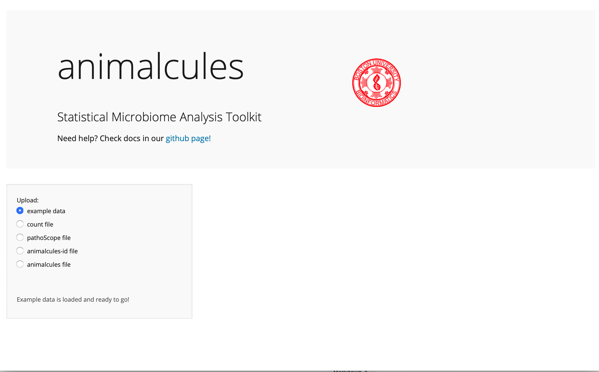
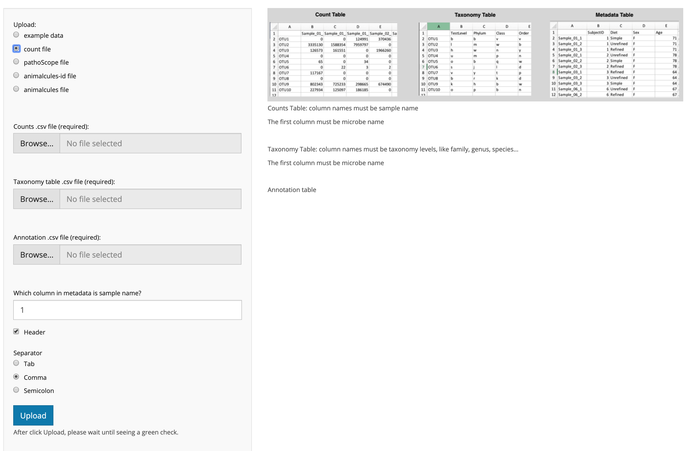
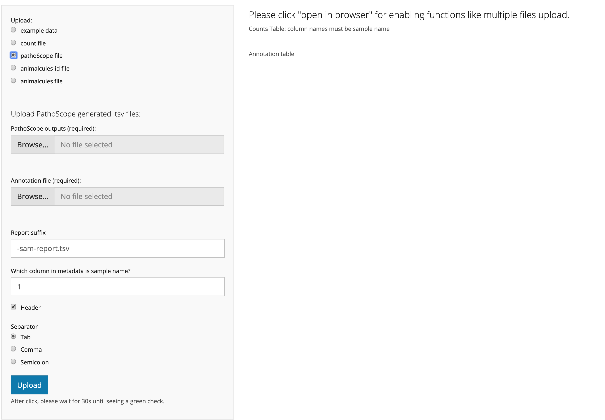
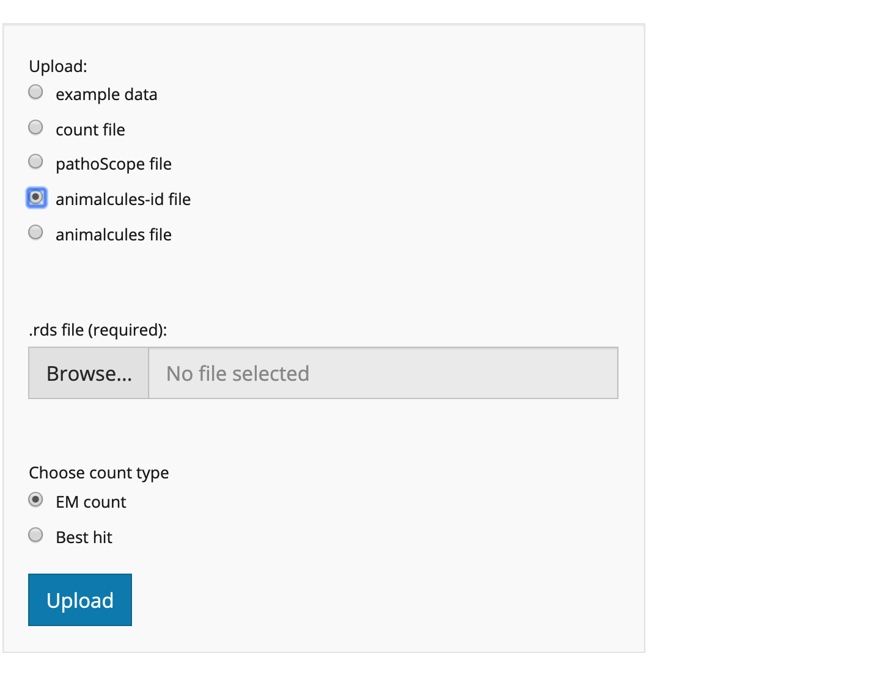
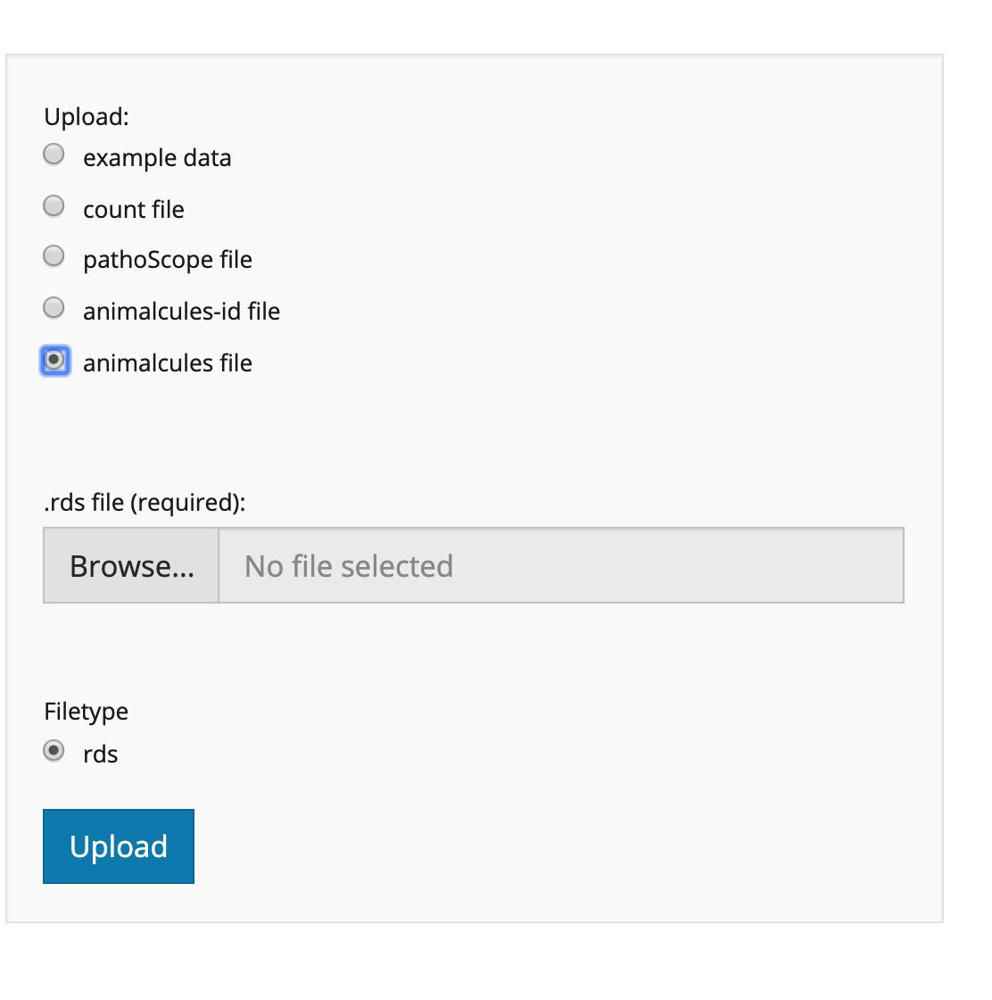

<p align="center"></p>

&nbsp;&nbsp;&nbsp;&nbsp;&nbsp;&nbsp;&nbsp;&nbsp;&nbsp;&nbsp;&nbsp;&nbsp;&nbsp;&nbsp;&nbsp;&nbsp;&nbsp;&nbsp;&nbsp;&nbsp;&nbsp;&nbsp;&nbsp;&nbsp;&nbsp;&nbsp;&nbsp;&nbsp;&nbsp;&nbsp;&nbsp;&nbsp;&nbsp;&nbsp;&nbsp;&nbsp;&nbsp;&nbsp;&nbsp;&nbsp;&nbsp;&nbsp;&nbsp;&nbsp;&nbsp;&nbsp;&nbsp;&nbsp;&nbsp;&nbsp;&nbsp;&nbsp;&nbsp;&nbsp;&nbsp;&nbsp;&nbsp;&nbsp;&nbsp;&nbsp;&nbsp;&nbsp;&nbsp;&nbsp;&nbsp;&nbsp;&nbsp;&nbsp;&nbsp;&nbsp;&nbsp;&nbsp;&nbsp;&nbsp;&nbsp;&nbsp;&nbsp;&nbsp;
[](https://travis-ci.org/compbiomed/animalcules)
[](https://github.com/compbiomed/animalcules/commits/master)
[](https://www.tidyverse.org/lifecycle/#maturing)


Table of Contents
=================

* [What does animalcules do?](#what-does-animalcules-do)
* [Installation](#installation)
* [Run animalcules](#run-animalcules)
* [Docs](#docs)
     * [Tab 1: Upload](#tab-1-upload)
     * [Tab 2: Summary and Filter](#tab-2-summary-and-filter)
     * [Tab 3: Abundance](#tab-3-abundance)
     * [Tab 4: Diversity](#tab-4-diversity)
     * [Tab 5: Dimension Reduction](#tab-5-dimension-reduction)
     * [Tab 6: Differential analysis](#tab-6-differential-analysis)
     * [Tab 7: Biomarker](#tab-7-biomarker)


## What does animalcules do?

**R shiny app for interactive microbiome analysis**

animalcules is an R package for utilizing up-to-date data analytics, visualization methods, and machine learning models to provide users an easy-to-use interactive microbiome analysis framework. It can be used as a standalone software package or users can explore their data with the accompanying interactive R Shiny application. 

Traditional microbiome analysis such as alpha/beta diversity and differential abundance analysis are enhanced, while new methods like biomarker identification are introduced by animalcules. Powerful interactive and dynamic figures generated by animalcules enable users to understand their data better and discover new insights. 


## Installation

Note: Install devtools first if you haven't installed it yet. 
You can install animalcules from github with:


``` r
# install.packages("devtools")
devtools::install_github("compbiomed/animalcules")
```

## Run animalcules


``` r
library(animalcules)
run_animalcules()
```

## Docs

### Tab 1: Upload

##### Example data

A simulated example dataset has been loaded into the package already, and users could use this dataset to try all functions and features in animalcules.


##### Count file

No matter what techniques generated the dataset (16s, metagenomics), as long as users have 3 required files, they could analyze via animalcules. The three required files are:

* Counts file: each row is a species/OTU, each column is a sample name.
* Taxonomy file: each row is a species/OTU, each column is a taxonomy level.
* Annotation file: each row is a sample name, each column is a variable/feature name.




##### Pathoscope file

To analyze pathoscope outputs, users need to upload pathoscope reports (use browser for multiple reports upload), as well as an annotation file containing metadata for each sample. Note that the sample name in the annotation file must match the non-suffix part of the pathoscope file name. For example, one pathoscope report filename is: "sample_011-sam-report.tsv", then the corresponding sample name in the annotation file must be: "sample_011". 

Also, make sure to provide the correct column number for sample name in the annotation file, as well as the annotation file separator (tab, comma or semicolon).



##### animalcules-id file

animalcules-id is a separate R pipeline that generates pathoscope-like outputs from fastq files. The required input is the animalcules-id generated .rds file.



##### animalcules file

In animalcules, users could choose to save their dataset to a .rds file in the Tab 2 (Summary and Filter). Later users could load this saved dataset by uploading this .rds file to animalcules easily via this animalcules file upload option.



### Tab 2: Summary and Filter

### Tab 3: Abundance

### Tab 4: Diversity

### Tab 5: Dimension Reduction

### Tab 6: Differential analysis

### Tab 7: Biomarker


