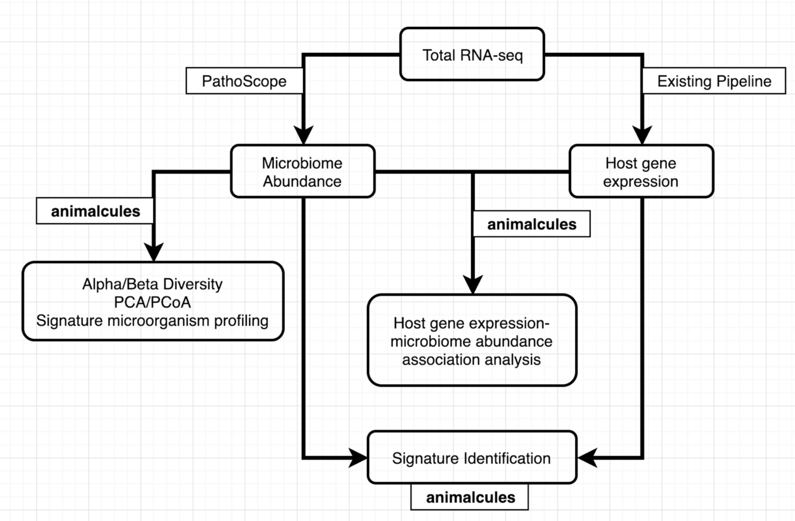

# animalcules
[](https://github.com/compbiomed/animalcules/commits/master)
[](https://www.tidyverse.org/lifecycle/#maturing)

The goal of animalcules is to study the biological sample using microbiome and transcriptome data. A typical workflow will be like:



## Installation

Note: Install devtools first if you haven't installed it yet. 
You can install animalcules from github with:


``` r
# install.packages("devtools")
devtools::install_github("compbiomed/animalcules")
```

## Run animalcules


``` r
library(animalcules)
run_animalcules()
```
